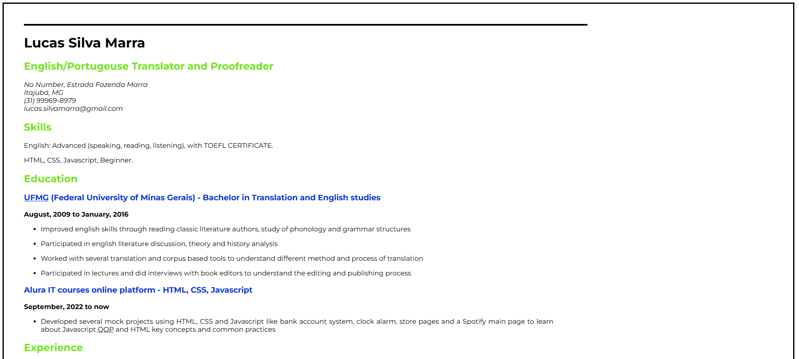

  <h1 align="center">
    Single-Page CV
  </h1>

 

# Objective 
Single-page CV for the HTML beginner project on Frontend Dev roadmap, at roadmap.sh.
  

# README
https://roadmap.sh/projects/single-page-cv
 
 

# PREVIEW

# Auxiliary Resources
<ol>
  <li>
    <a href="https://www.w3schools.com/tags/tag_meta.asp" alt="w3schools - <meta> tags">https://www.w3schools.com/tags/tag_meta.asp</a>
  </li>
  <li>
    <a href="https://ahrefs.com/blog/open-graph-meta-tags/" alt="ahrefsblog - Open-graph meta tags">https://ahrefs.com/blog/open-graph-meta-tags/</a>
  </li>
  <li>
    <a href="https://favicon.io/" alt="favicon.io">hhttps://favicon.io/</a>
  </li>
  <li>
    <a href="https://www.alura.com.br/artigos/escrever-bom-readme" alt="Como escrever um README incrível no seu Github">https://www.alura.com.br/artigos/escrever-bom-readme</a>
  </li>
</ol>
